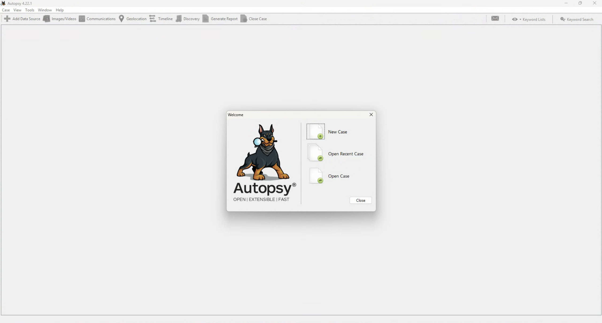
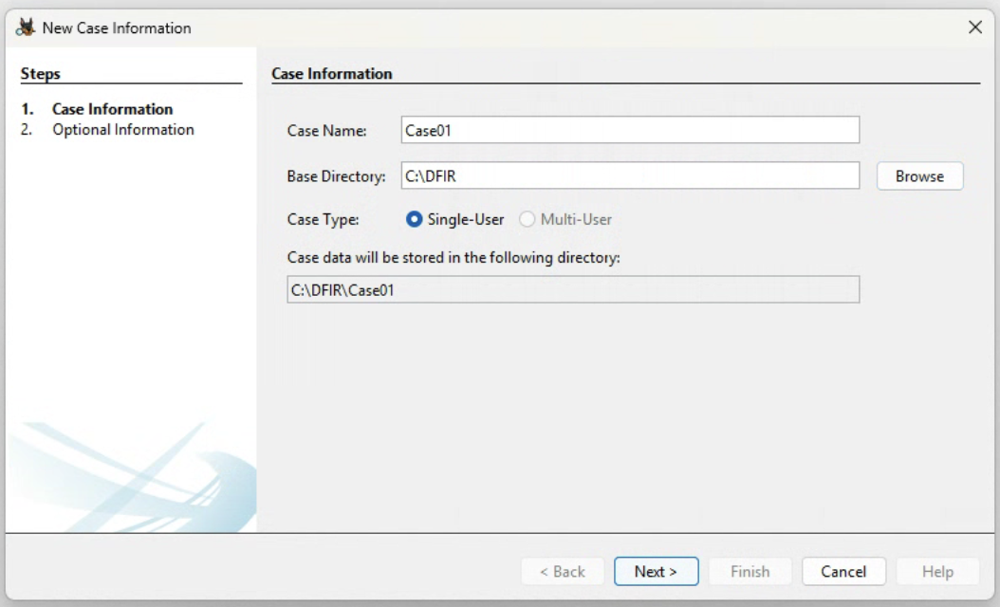
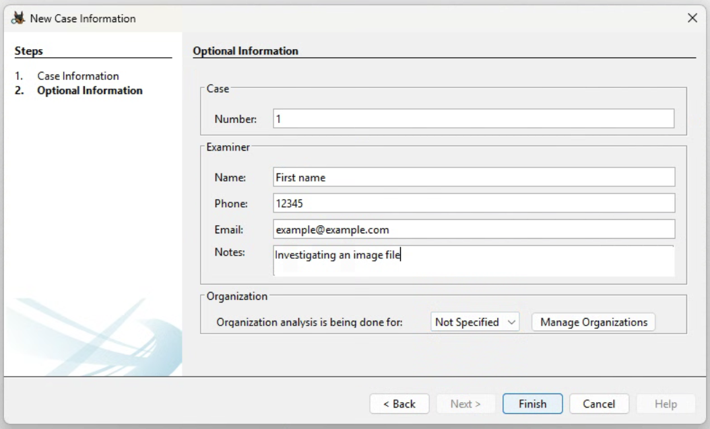
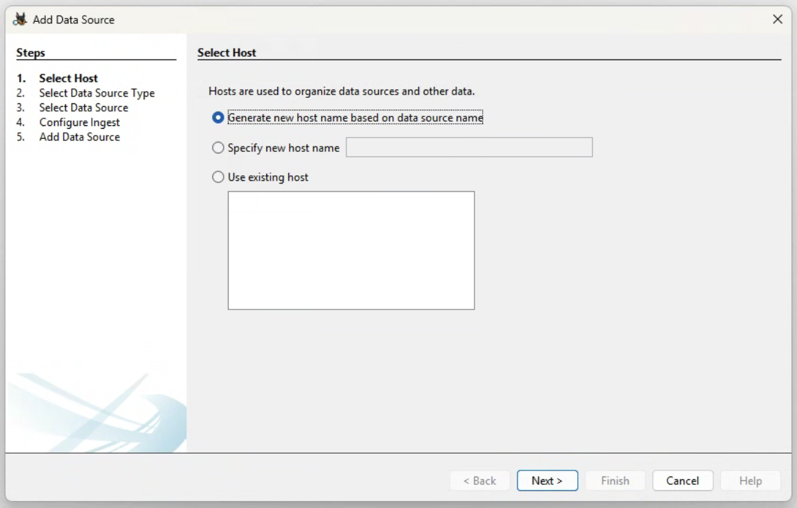
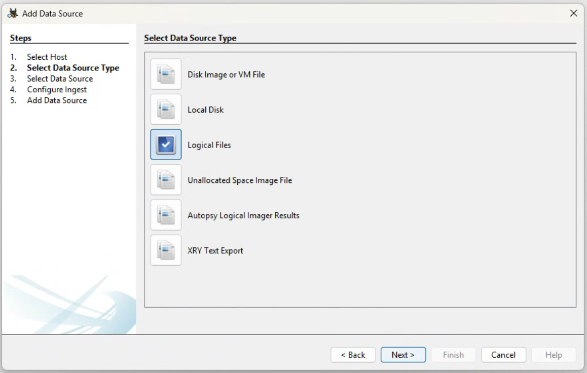
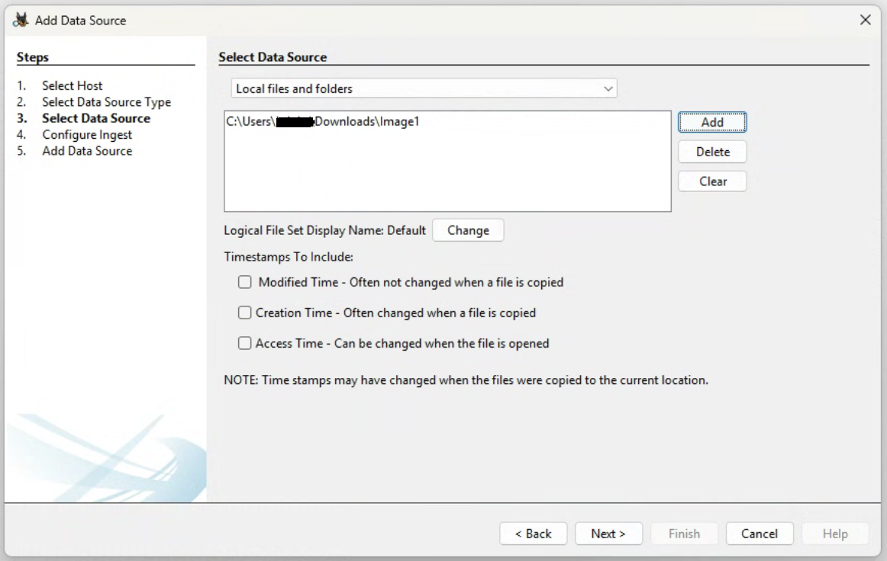
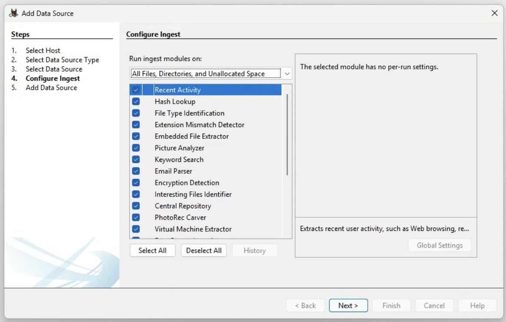
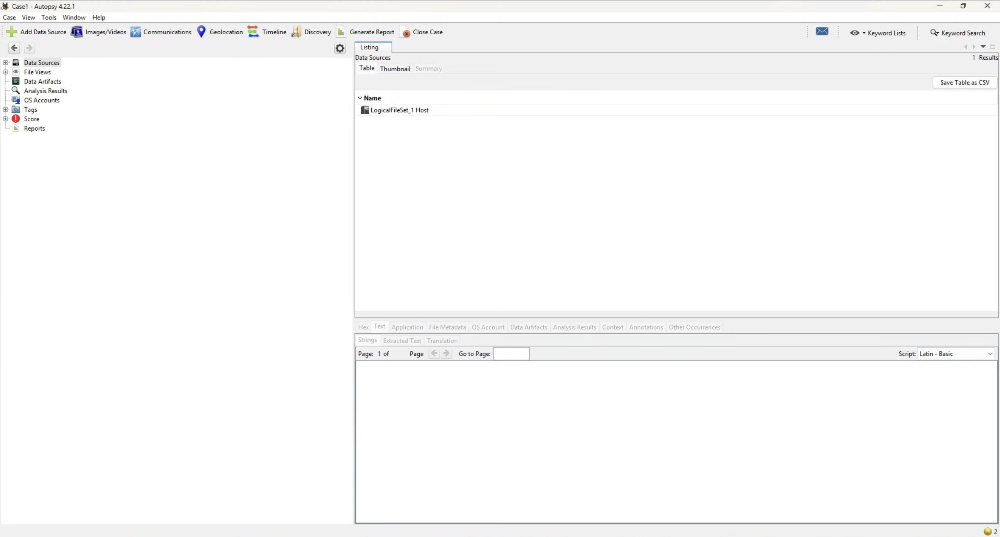
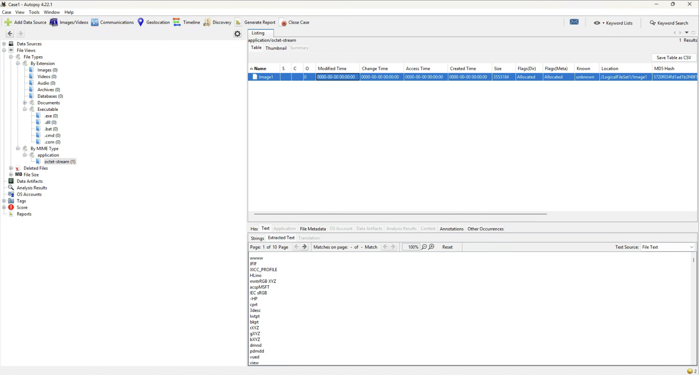
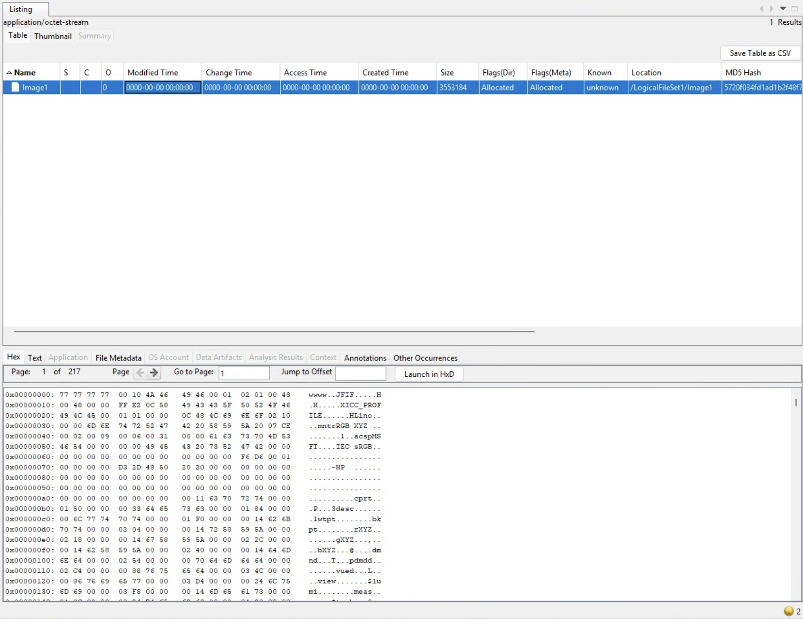

# Welcome to Lab 1

This lab will entail finding a 'corrupted image file' and how we can view this in Autopsy and then HxD in order to make it 'viewable' in both Autopsy and via the OS.

This lab has some prerequisites, please see the below as you will need to download some things:
- Download Autopsy - https://www.autopsy.com/download/
- Download HxD (Hex Editor) - https://mh-nexus.de/en/hxd/
- Download the [image](Image1)

After you have downloaded the above, you can proceed.

# Start 
Now that we have everything, we want to pretend that we need to do some **Forensic Analysis** on the image file that we have been provided.

Start with opening Autopsy, you will be greeted with the below prompt.

Click **New Case**

From here, choose your case name. You will also need to choose a **Base Directory**. This is where all of the configuration files and actual Autopsy file (.aut) will exist.

Now enter in your case details. Keep in mind it is best practice to ensure that when you are doing forensic investigations with Autopsy, that you correctly label your cases. This includes have a uniform syntax that you can use for future investigations for ongoing cases/investigations. See the below:

After this click finish. After this you will notice that Autopsy is creating the necessary files in the **Base Directory** that you just created.

Once Autopsy has finished creating the database/directory. We then need to choose a host, for this lab click on **Generate new host name based on data source name** and hit next. Reference image below:

Then we have to choose a data source. Typically you will add an **image** of a disk or something along those lines. For example, you may have a copy of a suspects hard drive.

For the sake of this lab, we are going to choose **Logical file**. Hit this and click next. Reference image below:

Now, we have to choose a logical file. Hit the **add** button and choose **Image1**. This is the image from the lab ([image](Image1)). Then hit next. Reference image below:

The next prompt will show us ingest modules. These modules are going to run against the images/files that we pass to Autopsy. For example, The File Type Identification ingest module will attempt to assign file types to all of the images within the data that we pass. Typically just select all and hit next. Reference image below:

On the next page hit finish.

You will then see the below:

To find out file, we can open up the directories/paths on the left side in Autopsy. See the below on how to find this in Autopsy.

Now from the intel we have gathered before opening Autopsy, it has been stated that this is an image file which we need to open/make viewable to find evidence. However, from the file (Image1) in Autopsy it is 1. not viewable and 2. does not appear to be an image.

However, there are some clues we can look for. As this is an image file, we can assume it may be a .jpg/.jpeg file. 
Open the Hex tab in Autopsy, we can see there is **FIF** listed in the right side. FIF is something which relates to jpg/jpeg. This can be thought of as a header. From this information, we can infer that this file is in-fact an image file which has had it's hex edited to obsfucate or hide the contents of said file for whatever reason. See the below reference:

At this point, we have identified that the file we have been provided *may* be an image file. You can edit a files hex for a multitude of reasons although in this case, we want to view the original contents of the file.

To do this we can open a Hex Editor. In this case/lab, we will be using HxD. On the same Hex tab, you will notice a **Launch in HxD** button. A quick note on this is that you have to add HxD to your Autopsy. However, if you have the original file, you can simply open this in HxD externally from Autopsy.

This is what it will look like in HxD.

Firstly, look at the first set of hex values, we can see for this image, it is set as **77 77 77 77**. This is not the typical header value for a *jpg* file. Therefore we can look online to the value is should be set as. The correct value is as follows **FF D8 FF E0**.

Therefore, in HxD, change the first values to the above mentioned values. Yours should look like the below:

Now, hit File > Save as > and name it something like "Recover1.jpg". Now depending on where you have saved it, open the image and it should look like the below:

At this point we have finished this lab, here are some key takeaways.
- You can use Autopsy to search for an image for things such as the Hex value, Metadata and much more.
- How you can use Autopsy to create a case.
- How you can use a Hex editor to change the value of a files hex to make it viewable.

