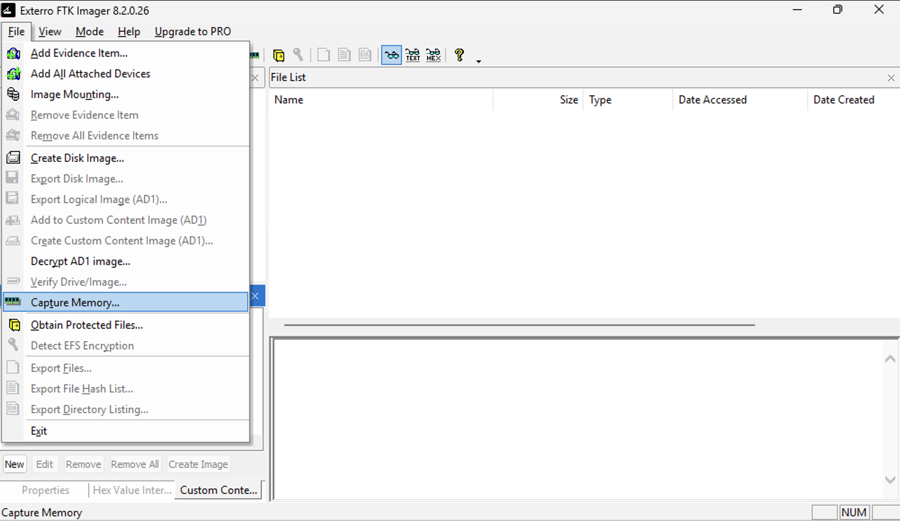
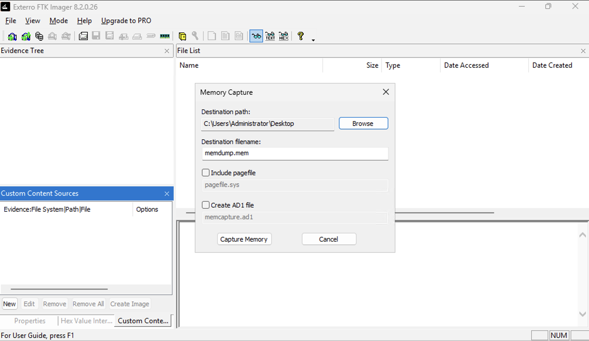
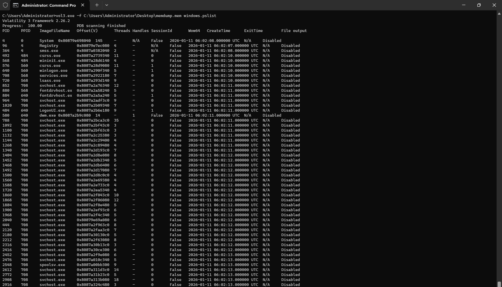

# Welcome to Lab 2

This lab will show you how to download FTK Imager and Volatility3 to take a memory dump on a Windows machine and analyse this.

This lab will require you to do some things, please see the below:
- You can do this with a Windows machine or a VM, this lab uses an EC2 instance.
- Download [FTK Imager](https://www.exterro.com/ftk-product-downloads/ftk-imager-pro-8-2-0-26)
- Download [Python](https://www.python.org/downloads/)
- Download [Pip](https://pypi.org/project/pip/), I did this via the article [here](https://phoenixnap.com/kb/install-pip-windows#Method_2_Install_pip_on_Windows_Using_get-pippy)
- Download [Volatility3](https://github.com/volatilityfoundation/volatility3)
- (Optional), you can add Volatility3 to PATH

# Additional notes
- Memory dumps can be large files, you need to ensure that your storage medium has enough space.
- Check the page file size before capturing it in FTK Imager, as this can be a very large file.
- Volatility3 is used as Volatility2 is single threaded.

# Start 
Once you have done the above on your Windows machine or VM you can now open **FTK Imager** on said machine.

Navigate to **File** and hit **Capture Memory...**



After this you will then see the next prompt where you will need to add the path and name where the Memory Dump file will live.



In the above, you can also choose if want to capture the page file as well. Please note that the page file can be very larger depending on how used the system is. If the system has been used for a long time without restarting the page file may be very large. You can learn more about this, here is an example [article](https://manage.accuwebhosting.com/knowledgebase/4791/What-is-pagefile.sys-and-how-to-reduce-itandsharp039s-size.html).

Once the file has been downloaded, you can now use volatility to analyse the memory dump. 

Run the following command.
- vol3.exe -f “/path/to/file” windows.pslist
Note: I have renamed vol.exe to vol3.exe as vol is also a Windows command which can be confusing when running it in the terminal. Below is an example:



The above command can show you the processes which were open (in memory). The below shows that firefox was opened at - 2026-01-11 06:03:26.000000 UTC and closed at - 2026-01-11 06:03:53.000000 UTC.

```
PID     PPID    ImageFileName   Offset(V)       Threads Handles SessionId       Wow64   CreateTime      ExitTime        File output
7164    7088    firefox.exe     0x8087a43a02c0  0       -       2       False   2026-01-11 06:03:26.000000 UTC  2026-01-11 06:03:53.000000 UTC    Disabled
```

FTK Image will also open as this is a process stored in memory, for example:

```
4728    5840    FTK Imager.exe  0x8087a4d7e080  20      -       2       False   2026-01-11 06:03:54.000000 UTC  N/A     Disabled
```

Other points of note is you can tell when the system was booted by checking the “System” process, this is the init process for Windows (different versions may show different output)

```
> vol3.exe -f C:\Users\Administrator\Desktop\memdump.mem windows.pslist
Volatility 3 Framework 2.26.2
Progress:  100.00               PDB scanning finished
PID     PPID    ImageFileName   Offset(V)       Threads Handles SessionId       Wow64   CreateTime      ExitTime        File output
> 

4       0       System  0x80879e698040  145     -       N/A     False   2026-01-11 06:02:08.000000 UTC  N/A     Disabled
```

